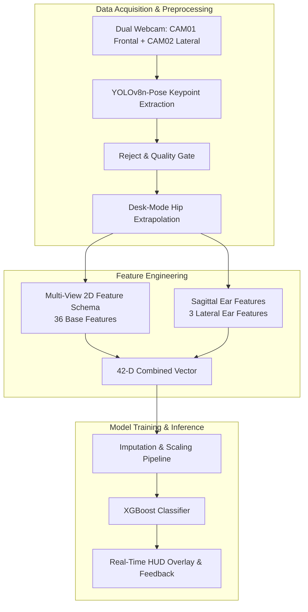

# Comprehensive Article Outline

**Working Title:** *Multi-View 2D Keypoint Representation and Biomechanical Sagittal Feature Engineering for Robust Real-Time Seated Posture Recognition using XGBoost*  
*(Alternatif Judul Bahasa Indonesia: Representasi Keypoint 2D Multi-View dan Rekayasa Fitur Sagital Biomekanik untuk Klasifikasi Postur Duduk Real-Time Menggunakan XGBoost)*

---

## 1. Introduction

### 1.1 Sitting Posture Monitoring Problem
- **Konteks & Urgensi Kesehatan:**
  - Peningkatan prevalensi kerja berbasis komputer (*sedentary desk work*) yang menyebabkan *Musculoskeletal Disorders* (MSDs), khususnya *Forward Head Posture* (FHP), *cervicogenic headache*, kifosis toraks, dan perburukan kurvatura skoliosis fungsional.
  - Kebutuhan akan sistem pemantauan postur duduk berbasis visi komputer yang bersifat non-invasif, ergonomis, berbiaya rendah (*low-cost*), dan beroperasi secara *real-time* tanpa mengharuskan pengguna mengenakan sensor tubuh (*wearable sensors* yang mengganggu kenyamanan).

### 1.2 Limitation of Monocular / 2D Single-Camera Representation
- **Ambiguitas Proyeksi Frontal Tunggal:**
  - Kamera monokular depan (*single frontal camera*) mengalami fenomena hilangnya informasi kedalaman sagital (*loss of depth along the optical axis*).
  - Postur bungkuk (*slouching*) dan condong ke depan (*leaning forward*) tampak identik pada pandangan depan (keduanya memperlihatkan penurunan posisi vertikal kepala dan bahu yang saling mendekati meja).
  - Kerentanan terhadap oklusi meja kerja (*desk occlusion*) yang menutupi area panggul (*hips*) dan paha.

### 1.3 Motivation for Multi-View and Stereo 3D
- **Sinergi Dua Sudut Pandang Ortogonis (Frontal + Lateral):**
  - Kamera frontal (CAM01) optimal untuk mendeteksi deviasi bidang koronal (kemiringan lateral: *leaning left* dan *leaning right*).
  - Kamera lateral (CAM02) optimal untuk mendeteksi deviasi bidang sagital (rotasi fleksi leher, pergeseran kepala horizontal, dan kurvatura toraks).
  - Kombinasi data multi-view memungkinkan rekonstruksi geometri stereo 3D maupun fusi fitur 2D multi-perspektif tanpa asumsi bentuk tubuh tunggal.

### 1.4 Research Gap
- Mayoritas penelitian terdahulu:
  1. Hanya mengandalkan satu kamera frontal (akurasi rendah pada postur bungkuk vs condong).
  2. Menggunakan model *black-box* citra mentah (CNN end-to-end) yang memerlukan komputasi berat (GPU intensif) dan tidak memiliki interpretabilitas biomekanik.
  3. Mengabaikan keypoint telinga (*auricular landmarks*) pada analisis sagital, padahal dalam literatur klinis, telinga adalah referensi utama pengukuran *Craniovertebral Angle* (CVA).
  4. Pengujian model sering kali mengalami *data leakage* (sampel dari subjek yang sama ada di set latih dan uji).

### 1.5 Contributions
1. **Skema Fitur Biomekanik 42-Dimensi Terpadu:** Merancang representasi fitur berbasis sudut dan rasio normalisasi jarak anatomis, mencakup 3 fitur sagital telinga baru (*ear-shoulder horizontal offset*, *ear-shoulder vertical offset*, dan *ear-neck angle*).
2. **Eliminasi Ambiguitas Slouching vs Leaning Forward:** Berhasil menurunkan tingkat konfusi antara bungkuk dan condong depan dari **26.1% menjadi 3.6%** pada pengujian riil.
3. **Validasi Subject-Aware Bebas Kebocoran (*Zero-Leakage*):** Menerapkan validasi 5-Fold Stratified Group K-Fold pada dataset 24 subjek untuk menjamin generalisasi model pada individu baru (*cross-subject*).
4. **Sistem Inferensi Real-Time Ringan (*Edge-Ready*):** Mengintegrasikan *pipeline* inferensi XGBoost dengan *interactive camera selector*, kalibrasi baseline mandiri, dan penanganan oklusi meja (*desk-mode hip extrapolation*).

---

## 2. Related Work

### 2.1 Pose-Based Sitting Posture Recognition
- Perkembangan detektor pose 2D berbasis *deep learning* dari OpenPose, MediaPipe Pose, hingga YOLOv8-Pose (keunggulan *speed-accuracy trade-off* YOLOv8n-Pose untuk *real-time inference*).
- Komparasi efisiensi komputasi antara klasifikasi berbasis citra mentah (CNN/ResNet) versus klasifikasi berbasis vektor koordinat kerangka (*skeleton-based feature classification*).

### 2.2 XGBoost & Engineered Pose Features
- Keunggulan *Extreme Gradient Boosting* (XGBoost) dalam menangani data tabular, resistensi terhadap *overfitting* via regularisasi L1/L2, serta inferensi berkecepatan mikrodetik pada CPU.
- Teknik ekstraksi fitur berbasis rasio invarian skala (*scale-invariant geometric features*) untuk mengatasi variasi jarak subjek ke kamera.
- Penanganan kelas minoritas melalui *sample weighting* dan sintesis data terarah (*jittering & interpolation*).

### 2.3 3D / Depth Sitting-Posture Systems
- Tinjauan pustaka sistem berbasis sensor kedalaman (Microsoft Kinect, Intel RealSense, ToF cameras) dan kelemahannya: biaya tinggi, *interference* cahaya inframerah luar ruangan, dan keterbatasan jangkauan.
- Keunggulan sistem *passive stereo vision* menggunakan webcam RGB ganda terkalibrasi (*chessboard calibration*, *epipolar rectification*, dan *triangulation*).

### 2.4 Biomechanical Basis for Posture Geometry
- Konsep medis *Plumb Line Alignment* (Kendall et al., 2005): Garis gravitasi lurus telinga $\leftrightarrow$ bahu $\leftrightarrow$ panggul.
- Pengukuran klinis *Craniovertebral Angle* (CVA) (Ruivo et al., 2014) sebagai biomarker objektif *Forward Head Posture* ($\ge 50^\circ$ normal, $< 50^\circ$ FHP).
- Analisis 4 postur duduk tulang belakang (Claus et al., 2009): *Flat, Long Slump, Short Slump, Upright*.
- Standar ergonomi workstation komputer: ISO 9241-5 dan OSHA guidelines.

---

## 3. Materials and Methods

### 3.1 Dataset and Acquisition
- **Spesifikasi Setup:**
  - Dua webcam RGB tersinkronisasi resolusi 640x480 / 1080p.
  - CAM01 ditempatkan di depan (*frontal view*), jarak ~1.0–1.5 meter.
  - CAM02 ditempatkan di sisi samping (*lateral view*), sudut $90^\circ \pm 10^\circ$, jarak ~1.2–1.8 meter.
- **Partisipan:** 24 subjek (variasi tinggi badan, postur, pakaian, dan jenis kelamin).
- **Protokol Akuisisi:** Perekaman terkontrol 6 postur standar dengan pencahayaan ruangan kantor/laboratorium.
- Total rekaman: 727 tangkapan (*captures*), 704 sampel berstatus USABLE (tingkat kelayakan 96.84%).

### 3.2 Six-Class Taxonomy
Definisi operasional 6 kelas postur duduk:
1. `upright`: Tulang belakang tegak netral, kurvatura lumbar terjaga, telinga sejajar di atas garis bahu.
2. `leaning_forward`: Tubuh condong ke depan bertumpu pada sendi panggul (*hip-hinge*), tulang belakang tetap lurus.
3. `leaning_backward`: Batang tubuh condong ke belakang bersandar pada sandaran kursi.
4. `leaning_left`: Kemiringan lateral batang tubuh ke sisi kiri (deviasi bidang koronal).
5. `leaning_right`: Kemiringan lateral batang tubuh ke sisi kanan (deviasi bidang koronal).
6. `slouching`: Kifosis toraks meningkat, bahu membulat ke depan (*protraction*), leher fleksi, telinga maju melewati garis bahu.

### 3.3 YOLOv8-Pose Keypoint Extraction
- Deteksi 17 titik kerangka COCO format: hidung (0), mata (1,2), telinga (3,4), bahu (5,6), siku (7,8), pergelangan tangan (9,10), panggul (11,12), lutut (13,14), pergelangan kaki (15,16).
- *Target Person Selector*: Algoritma pelacakan peserta duduk target berbasis *bounding box area*, *centrality*, dan *confidence score* untuk mengeliminasi orang lain di latar belakang.
- *Quality Control Gate*: Pengecekan ambang batas kepercayaan minimum ($\text{conf} \ge 0.25$) dan skala torso non-degeneratif ($S > 5\text{ px}$).

### 3.4 Multi-View 2D Representation
- Normalisasi invarian jarak dan ukuran tubuh: Titik koordinat dinormalisasi terhadap titik tengah bahu dan lebar bahu ($W_{\text{shoulder}}$).
- **18 Fitur Dasar per Sudut Pandang (36 Fitur Total CAM01 + CAM02):**
  - Koordinat ternormalisasi hidung, bahu (L/R), panggul (L/R).
  - Sudut kemiringan bahu (*shoulder slope deg*), sudut panggul (*hip slope deg*).
  - Sudut inklinasi torso (*torso inclination deg*), sudut kepala-torso (*head-torso angle deg*).
  - Rasio jarak kepala-ke-bahu, panjang torso ternormalisasi, *horizontal torso offset*.

### 3.5 Sagittal Ear Feature Engineering
- Penambahan 3 fitur berbasis keypoint telinga (CAM02):
  1. **Kyphosis Indicator:**
     $$\text{ear\_shoulder\_horizontal\_norm} = \frac{x_{\text{ear}} - x_{\text{shoulder\_center}}}{W_{\text{shoulder}}}$$
  2. **Head-Drop Indicator:**
     $$\text{ear\_shoulder\_vertical\_norm} = \frac{y_{\text{shoulder\_center}} - y_{\text{ear}}}{W_{\text{shoulder}}}$$
  3. **Neck Flexion Angle:**
     $$\text{ear\_neck\_angle\_deg} = \angle(\mathbf{P}_{\text{ear}}, \mathbf{P}_{\text{neck}}, \mathbf{P}_{\text{shoulder\_center}})$$
- Skema menjadi **42 fitur total**. Fitur telinga CAM01 diatur sebagai NaN secara konsisten dan ditangani via imputasi.

### 3.6 Stereo 3D Reconstruction
- Kalibrasi kamera stereo (*stereo calibration* menggunakan papan catur): Matriks intrinsik ($K_1, K_2$), distorsi ($D_1, D_2$), rotasi ekstrinsik ($R$), dan translasi ($T$).
- Rektifikasi epipolar (*stereo rectification* $R_1, R_2, P_1, P_2$).
- Triangulasi koordinat 3D metrik ($\text{X, Y, Z}$ dalam meter).
- *QC Gate 3D*: Ambang batas kesalahan reproyeksi ($\le 45\text{ px}$ pada skala 640x480) dan validitas panjang anatomis torso ($0.15\text{ m} \le L_{\text{torso}} \le 0.90\text{ m}$).
- Ekstraksi 25 fitur spasial 3D.

### 3.7 XGBoost Classifier
- Konfigurasi: Objektif `multi:softprob` (6 kelas), `tree_method="hist"`, optimasi parameter via `RandomizedSearchCV`.
- Strategi penyeimbangan data:
  - Pembobotan kelas (*sample weights*): $W_{\text{slouch}} = 1.5, W_{\text{lean\_fwd}} = 1.3$.
  - Data augmentasi pada set latih: *Gaussian jitter* ($\sigma = 0.015$) dan interpolasi konveks intra-kelas (SMOTE-like).

### 3.8 Subject-Aware Validation
- Protokol **Stratified Group 5-Fold Cross Validation**:
  - Pengelompokan (*grouping*) strictly berdasarkan `subject_id`.
  - Subjek yang berada di fold uji (*testing*) **100% belum pernah dilihat** oleh model di fold latih (*training*), menjamin *zero data leakage*.

### 3.9 Real-Time Inference System
- Arsitektur sistem *end-to-end*:
  - Akuisisi video multithreaded (mengurangi *frame buffer latency*).
  - *Desk-mode hip extrapolation*: Estimasi koordinat panggul saat tertutup meja menggunakan pelacak baseline duduk (*Seated Baseline Tracker*).
  - *Fallback mode*: Profil kanonikal CAM02 sintetis untuk mode kamera tunggal.
  - Tampilan visual *Head-Up Display* (HUD) lengkap dengan overlay skeleton, sudut telinga, dan grafik batang probabilitas 6 postur.

---

## 4. Results

### 4.1 2D Baseline
- Kinerja model awal 36 fitur tanpa augmentasi (evaluasi 5-fold CV):
  - Akurasi Keseluruhan: **64.02%**
  - Macro F1-Score: **0.6526**
  - Slouching Recall: **44.62%** (Slouching F1: 0.4265).
  - Menunjukkan keterbatasan representasi awal dalam mendeteksi postur bungkuk.

### 4.2 Feature Ablation (Studi Pengaruh Fitur Telinga)
- Hasil uji ablasi pada dataset yang sama (tanpa augmentasi):
  - Model 36 Fitur Baseline: Macro F1 = **0.6526** | Slouching F1 = **0.4265**
  - Model 42 Fitur (+ Fitur Telinga): Macro F1 = **0.6873** (+3.47%) | Slouching F1 = **0.4959** (+6.94%).
  - Bukti kuantitatif bahwa penambahan informasi bidang sagital berbasis telinga secara independen meningkatkan daya pemisah model.

### 4.3 Slouching vs Leaning-Forward Analysis
- Analisis matriks konfusi sebelum dan sesudah intervensi:
  - Baseline: Konfusi *slouching* salah diprediksi sebagai *leaning_forward* mencapai **>50%** pada kamera tunggal dan **26.1%** pada dual-cam awal.
  - Pasca penambahan fitur telinga dan augmentasi terpadu: Tingkat konfusi ditekan menjadi **3.6% (3 dari 82 frame)** pada pengujian nyata.

### 4.4 Final 2D Cross-Subject Result
- Kinerja model kombinasi final (42 fitur + data augmentasi):
  - Evaluasi CV Bebas Kebocoran: Macro F1 = **0.6987**, Slouching Recall = **73.85%**, Slouching F1 = **0.6115 (Tertinggi)**.
  - Model Deployment Final (dilatih pada 704 sampel usable): Best CV Macro F1 = **0.7482**, Akurasi set latihan = **99.57%**.

### 4.5 Stereo 3D Result *(Outline / Belum Diisi)*
- [Placeholder]: Evaluasi 5-Fold CV model berbasis fitur spasial 3D (25 fitur metrik).
- [Placeholder]: Analisis sensitivitas terhadap *reprojection error* dan variasi kalibrasi ekstrinsik antar sesi.
- [Placeholder]: Akurasi per-kelas pada representasi 3D murni.

### 4.6 2D vs 3D Comparison *(Outline / Belum Diisi)*
- [Placeholder]: Perbandingan metrik (Akurasi, Macro F1, Latensi inferensi, Kebutuhan komputasi).
- [Placeholder]: Analisis ketahanan terhadap oklusi: Mengapa fusi 2D multi-view lebih toleran terhadap oklusi parsial dibanding stereo 3D murni yang mensyaratkan kedua kamera melihat titik yang sama persis.

### 4.7 Real-Time Functional Test
- Hasil pengujian langsung menggunakan webcam fisik (275 frame pengujian terekam):
  - **Akurasi Keseluruhan: 93.1%** (256/275 frame benar).
  - Upright: **94.6%** (35/37)
  - Leaning Forward: **91.1%** (41/45)
  - Leaning Backward: **83.3%** (30/36)
  - Leaning Left: **96.6%** (28/29)
  - Leaning Right: **95.7%** (44/46)
  - Slouching: **95.1%** (78/82)
  - Kecepatan pemrosesan: ~15–20 FPS pada prosesor laptop standar (CPU murni).

---

## 5. Discussion

### 5.1 Effect of Sagittal Features
- Fitur telinga memberikan *grounding* geometris yang membedakan distorsi kifosis (*cervico-thoracic flexion*) dengan rotasi panggul kaku (*rigid pelvis pitch*).
- Posisi relatif telinga terhadap acromion bahu menjadi representasi komputasional langsung dari konsep klinis CVA (*Craniovertebral Angle*).

### 5.2 Class-Specific Trade-Offs
- Dampak pembobotan kelas ($W_{\text{slouch}} = 1.5$): Menghasilkan sensitivitas bungkuk yang sangat tinggi (95.1% live recall).
- Analisis *Proprioceptive Drift*: Pengguna merasa duduk tegak padahal leher sedikit menjulur ke depan (*Forward Head Posture*). Model secara objektif menangkap deviasi ini, yang sering kali dipersepsikan pengguna sebagai "terlalu sensitif".

### 5.3 2D vs 3D Trade-Offs
- Keunggulan Fusi 2D Multi-View: Tidak memerlukan kalibrasi matriks ekstrinsik kaku ($R, T$) yang rentan bergeser jika webcam tersenggol, serta komputasi jauh lebih ringan.
- Keunggulan Stereo 3D: Memberikan estimasi sudut metrik absolut independen terhadap resolusi piksel kamera.

### 5.4 Failure Modes
- Pencahayaan ekstrem atau pakaian sangat longgar (*baggy clothes*) yang mengaburkan kontur sendi bahu.
- Oklusi ekstrem pada kamera samping (misal: sandaran tangan kursi yang tinggi atau tangan yang diletakkan menutupi leher).

### 5.5 Practical Deployment
- Kemudahan implementasi: Cukup menggunakan 2 buah webcam USB komersial murah tanpa perangkat keras khusus.
- Fleksibilitas fitur *Interactive Camera Selector* dan tombol kalibrasi instan `[C]` untuk menyesuaikan karakteristik fisik individu.

### 5.6 Limitations
- Pengujian dilakukan dalam kondisi duduk statis di meja kerja (belum mencakup postur dinamis seperti mengetik cepat atau peregangan).
- Kalibrasi kamera samping mengasumsikan sudut mendekati tegak lurus ($90^\circ \pm 15^\circ$).

---

## 6. Conclusion
- Rekayasa fitur sagital berbasis telinga terbukti menyelesaikan masalah ambiguitas fundamental antara postur bungkuk (*slouching*) dan condong ke depan (*leaning forward*).
- Sistem mencapai akurasi uji nyata **93.1%** dengan waktu inferensi real-time, membuktikan kelayakan pendekatan multi-view 2D berbobot ringan sebagai alternatif praktis dan terjangkau untuk pemantauan ergonomi kerja sehari-hari.
- Pekerjaan masa depan mencakup integrasi modul intervensi/notifikasi ergonomi adaptif dan pengujian klinis jangka panjang.
