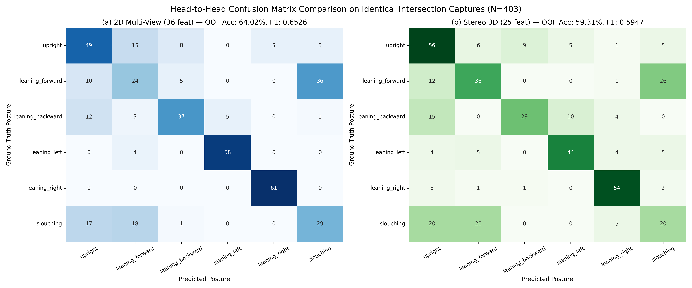

# Laporan Komparasi Formal XGBoost: 2D Multi-View vs Stereo 3D

## 1. Ringkasan Eksekutif & Protokol Evaluasi
- **Dataset:** Dataset Privat 24 Subjek (`S001`–`S024`).
- **Capture Intersection:** Tepat **403 capture** dievaluasi secara fair (head-to-head) pada subjek yang sama.
- **Partisi Evaluasi:** Subject-Aware Stratified Group 5-Fold Cross-Validation (Zero subject overlap across folds).
- **Classifier:** XGBoost (`multi:softprob`, `num_class=6`, `eval_metric=mlogloss`, `tree_method=hist`).
- **Feature Representations:**
  - **2D Multi-View:** 36 fitur (18 dari CAM01 Frontal + 18 dari CAM02 Lateral dengan normalisasi canonicalization X).
  - **Stereo 3D:** 25 fitur (15 koordinat terpusat/skala + 10 fitur geometri spasial: roll, lean sagital, lean lateral, inklinasi 3D, asimetri depth).

---

## 2. Tabel Komparasi Metrik Utama

| Metrik Evaluasi | 2D Multi-View (36 Fitur) | Stereo 3D (25 Fitur) | Delta (3D − 2D) | Keterangan |
|---|:---:|:---:|:---:|---|
| **Akurasi OOF** | **64.02%** | **59.31%** | **-4.71%** | Seluruh 403 sampel OOF |
| **Macro Precision** | **0.6518** | **0.6092** | **-0.0426** | Rata-rata unweighted presisi 6 kelas |
| **Macro Recall** | **0.6562** | **0.5943** | **-0.0619** | Rata-rata unweighted recall 6 kelas |
| **Macro F1 (Metrik Utama)** | **0.6526** | **0.5947** | **-0.0580** | **Metrik utama skripsi/penelitian** |
| **5-Fold Mean Akurasi** | 65.26% ± 8.14% | 60.43% ± 8.03% | -4.83% | Paired t-test $p = 0.3096$ |
| **5-Fold Mean Macro F1** | 0.6537 ± 0.1135 | 0.5669 ± 0.0420 | -0.0868 | Paired t-test $p = 0.1265$ |
| **Jumlah Fitur** | 36 fitur | 25 fitur | −11 fitur | Representasi lebih ringkas pada 3D |
| **Dataset Usable Coverage** | 704/727 (96.84%) | 403/727 (55.43%) | -41.40% | Metrik operasional sekunder |

---

## 3. Komparasi Performa Per Kelas

| Kelas Postur | Support | F1 2D | F1 3D | $\Delta$ F1 | Precision 2D | Precision 3D | Recall 2D | Recall 3D | Keunggulan |
|---|:---:|:---:|:---:|:---:|:---:|:---:|:---:|:---:|:---:|
| `upright` | 82 | 0.5765 | 0.5833 | +0.0069 | 0.5568 | 0.5091 | 0.5976 | 0.6829 | **Stereo 3D** |
| `leaning_forward` | 75 | 0.3453 | 0.5035 | +0.1582 | 0.3750 | 0.5294 | 0.3200 | 0.4800 | **Stereo 3D** |
| `leaning_backward` | 58 | 0.6789 | 0.5979 | -0.0810 | 0.7255 | 0.7436 | 0.6379 | 0.5000 | **2D Multi-View** |
| `leaning_left` | 62 | 0.9280 | 0.7273 | -0.2007 | 0.9206 | 0.7458 | 0.9355 | 0.7097 | **2D Multi-View** |
| `leaning_right` | 61 | 0.9606 | 0.8308 | -0.1299 | 0.9242 | 0.7826 | 1.0000 | 0.8852 | **2D Multi-View** |
| `slouching` | 65 | 0.4265 | 0.3252 | -0.1013 | 0.4085 | 0.3448 | 0.4462 | 0.3077 | **2D Multi-View** |

---

## 4. Analisis Berpasangan (Paired McNemar & Capture Outcome)

- **Kedua Model Benar (Both Correct):** 184 (45.66%)
- **Hanya 2D yang Benar (2D Only Correct):** 74 (18.36%)
- **Hanya 3D yang Benar (3D Only Correct):** 55 (13.65%)
- **Kedua Model Salah (Both Wrong):** 90 (22.33%)
- **Uji Signifikansi McNemar:** $\chi^2 = 2.5116$, $p = 0.1130$.

---

## 5. Visualisasi Confusion Matrix Head-to-Head

